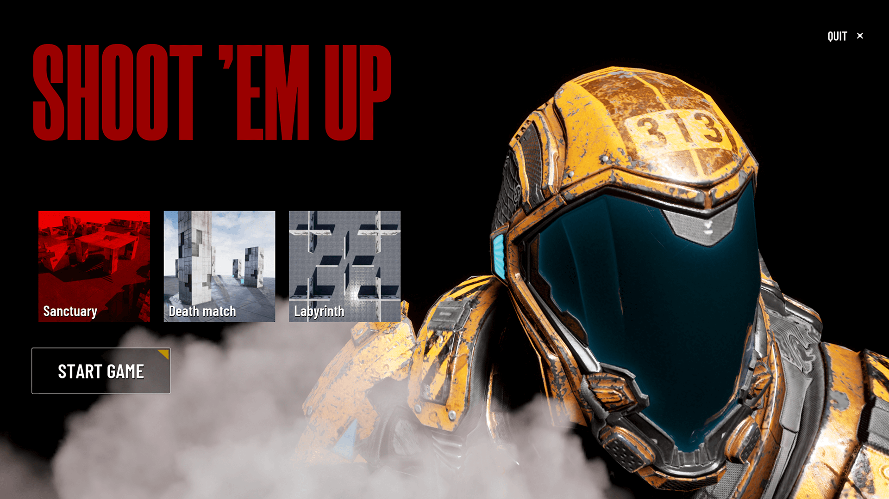
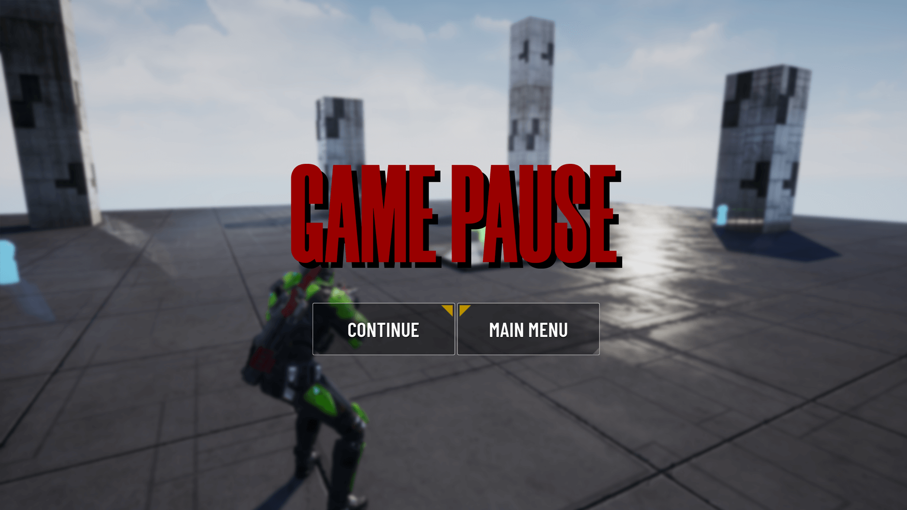
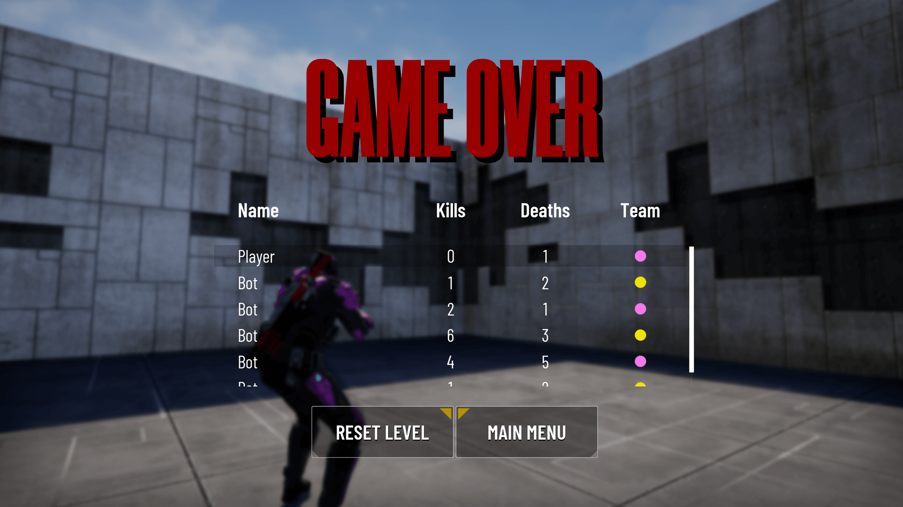
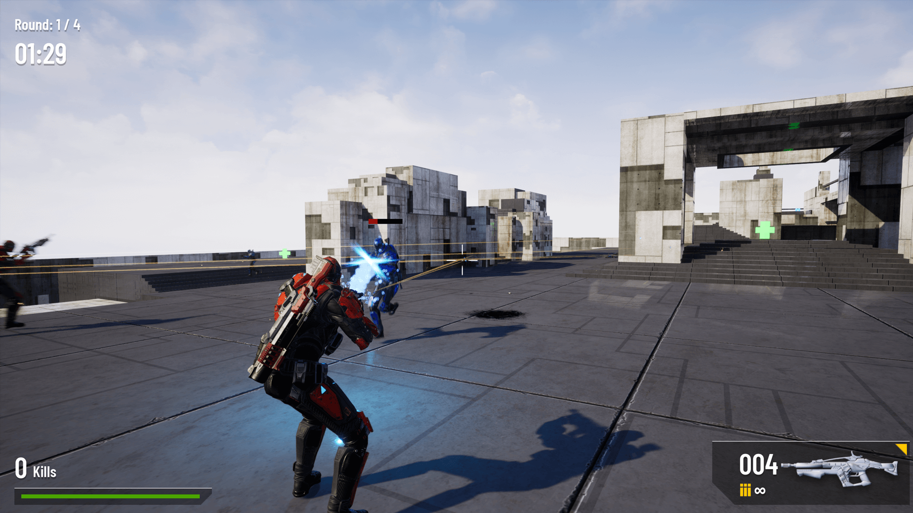

Shoot Them Up is a simple arcade shooter project developed as part of the study of Unreal Engine 4.26.2. This project was created to demonstrate my skills in game development and the use of Unreal Engine tools.

Peculiarities:
Simple and clear gameplay
Using basic shooting and character control mechanics
Simple visualization and sound design

Images:

